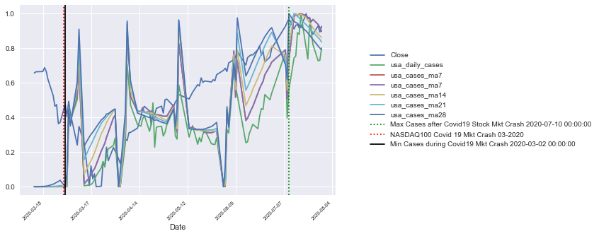

# Were US Covid19 daily case numbers a predictor for the NASDAQ stock market index in 2020?

## Project Analysis

The global Covid19 pandemic has, on an economic scale, shaken markets from all levels from micro to macro. But, did it shake the Nasdaq stock index and move it faster, and if so, which factors of daily US Covid19 ma case numbers were predominant predictors?

## Process Overview

## Data Sources 
US Covid19 case numbers were sourced from the European Centre for Disease Prevention and Control (ECDC): https://www.ecdc.europa.eu/en/covid-19/situation-updates 
It should be noted that the case numbers reported to ECDC depended upon the clear, targeted reporting of that country with a strong approach to controlling transmission; this approach developed by each country differently over time.

Data for the Nasdaq Daily close price was extracted from yahoo finance.

Both data types were reshaped to include weekly moving average indicators from 7 to 28 days, 6 months before and after the initial reporting of Covid19.  Data was joined by daily date index and piped into a csv data file to be processed for modelling.

## Visualisation
From a general visual double-y axis plot of the data, you can see quite obviously that the US Covid 19 Daily case numbers did not display a tight relation with the NASDAQ daily close price; except for the initial fall(stock market crash) of the case numbers in March 2020, after which it continued to rise:

## Data Modelling - Time Series

Time series modelling was performed to derive which period of time resulted in the strongest predictors for the Nasdaq100 price when running timeseries train test splits separated into the following periods: BEFORE Covid19, FIRST MONTH Covid19, DURING Covid19 and BEFORE and AFTER Covid19?

There were no seasonal trends and no radical shifts, further clarified as 'non-random' by a strong P value that would allow us to confirm that the Nasdaq index price traded faster/slower on the daily ma during the Covid19 period.

The co-efficient values on the train test split DURING and in the FIRST MONTH of Covid19 showed a STRONGER predictive value as compared to the periods that included both BEFORE AND DURING Covid19. The shorter the period modelled of Covid19, the easier it was to predict the close price.

## Data Modelling - Linear Regression

Which US Covid19 daily case moving averages showed the strongest relationship with the US Nasdaq moving averages by Linear Regression. Moving averages were calculated weekly from 7 days to 28 days for both types of data.

When modelling with linear regression stepwise selection the US Covid19 14 Day moving average resulted with the strongest feature values.  The NASDAQ 7 and 14 Day Moving Averages also were defined in stepwise selection as a strong feature.

The R squared value (0.310) for the Covid19 14 Day Moving average was not sufficient to recommend that this feature was a significantly strong predictor for the change in daily NASDAQ close price.

## Conclusions 
* Linear regression was the best-performing classifier, deciding which daily case moving averages were most related, given that the Nasdaq daily moving averages (1-10) did not show a significant change in daily ma transaction speed between before and during covid19.

* When running a timeseries on the NASDAQ moving averages (2days — 10 days differencing lag) train test split on different periods:
6 MONTHS BEFORE Covid19
FIRST MONTH of Covid19
DURING Covid19
6 MONTHS BEFORE AND AFTER Covid19
The returned result from the model with the strongest linear relationship was FIRST MONTH Covid19.

* Further When modelling a linear regression stepwise selection the US Covid19 14 Day moving average resulted with the strongest feature values.  The NASDAQ 7 and 14 Day Moving Averages also were defined in stepwise selection as a strong feature.

*  The R squared value (0.310) for the Covid19 14 Day Moving average was not sufficient to recommend that this feature was a significantly strong predictor for the change in daily NASDAQ close price.

* In final recommendations, I would not recommend that US Daily Covid19 case numbers be used for strong prediction of the NASDAQ daily close price.

* Next steps could include modelling data with faster moving averages of the NASDAQ price (for example by minute, hour(s)). Alternatively other data representing significant news announcements related to Covid19 could be modeled for feature selection (for example vaccine announcements on twitter or other news sources)

